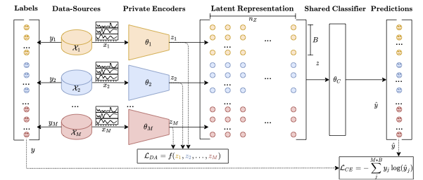

# DAPE Framework
DAPE (Domain Aligned Private Encoders) is a Framework for learning from multiple data-sources. Thereby, multiple encoders are jointly trained on data of different data-sources while using one common classifier. An MMD Loss is used for aligning the learnt representations of the encoders during train-time.

## Citation
If you find this work helpfull, please cite the paper, this repository is based on
```
@INPROCEEDINGS{DAPE2022Bethge,
  author={Bethge, David and Hallgarten, Philipp and Grosse-Puppendahl, Tobias and Kari, Mohamed and Mikut, Ralf and Schmidt, Albrecht and Özdenizci, Ozan},
  booktitle={ICASSP 2022 - 2022 IEEE International Conference on Acoustics, Speech and Signal Processing (ICASSP)}, 
  title={Domain-Invariant Representation Learning from EEG with Private Encoders}, 
  year={2022},
  volume={},
  number={},
  pages={1236-1240},
  doi={10.1109/ICASSP43922.2022.9747398}}

```

## Description
The DAPE Framework consists of mutliple encoders, one for each-data source. The encoder backbone can be chosen freely, it is also possible to use different encoders for different data-sources. The only constrain consists in the encoders outputs needing to have the same shape. The latent representations output by the encoders are used as input for a shared classifier, which makes predictions for each sample of each data-source. A visualization of the Framework is shown in the following figure. <br/><br/>.

## How to use it
In order to train the Framework, you can use the methods in `pipeline_funcs.py`, i.e. `train` and `test` to build yourself a custom pipeline. Else you can get a head start by using the method `pipeline` in the file `pipeline.py` to train and test a DAPE Framework. For more information on the methods parameters, please refer to the comments in the files.

## Contact
If you have any question or ideas feel free to reach out on me!
